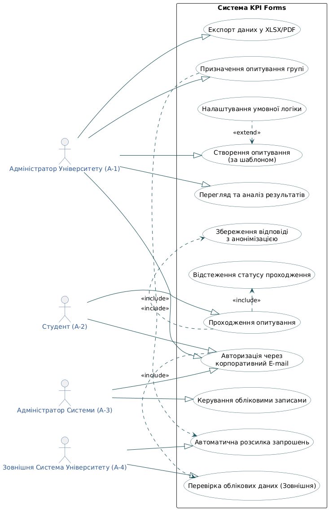

# Специфікація Use Case для системи «KPI Forms»

Документ містить деталізований опис ключових прецедентів (Use Case) системи «KPI Forms», що є основою для розробки функціональних вимог. Прецеденти розроблені на основі загальної моделі (UC-модель).

## 1. Специфікація: UC-1 Авторизація через корпоративний E-mail

| Поле | Опис |
| :--- | :--- |
| **ID** | UC-1 |
| **Назва** | Авторизація через корпоративний E-mail |
| **Учасники** | Студент (A-2), Адміністратор (A-1), Адміністратор Системи (A-3), Система, Зовнішня Система Університету (A-4) |
| **Передумови** | Користувач знаходиться на сторінці входу. Обліковий запис користувача існує в реєстрі Зовнішньої Системи Університету. |
| **Результати** | Користувач успішно авторизований у Системі «KPI Forms» із відповідною роллю. Створено активну сесію користувача. |
| **Виключні ситуації** | 1. **Невірні облікові дані:** Користувачу видається повідомлення про помилку входу. 2. **Некорпоративний E-mail:** Обліковий запис не належить до домену університету. Система блокує вхід та повідомляє про необхідність використання корпоративної пошти. 3. **Тимчасова недоступність A-4:** Неможливо виконати **UC-2**. Система видає повідомлення про технічну помилку та пропонує спробувати пізніше. |
| **Сутності** | Логін (E-mail), Пароль, Сесія користувача, Токен авторизації. |
| **Основний сценарій** | 1. **Користувач (A-1, A-2 або A-3)** вводить свій корпоративний E-mail та пароль. 2. **Система** ініціює **UC-2** (Перевірка облікових даних) через **Зовнішню Систему Університету (A-4)**. 3. **Система** отримує підтвердження успішної аутентифікації. 4. **Система** перевіряє, чи належить E-mail до дозволеного корпоративного домену. 5. **Система** створює сесію, надає доступ відповідно до ролі користувача та перенаправляє його на головну сторінку. 6. **Система** генерує стан виконання операції. |

## 2. Специфікація: UC-3 Створення опитування (за шаблоном)

| Поле | Опис |
| :--- | :--- |
| **ID** | UC-3 |
| **Назва** | Створення опитування (за шаблоном) |
| **Учасники** | Адміністратор Університету (A-1), Система |
| **Передумови** | A-1 авторизований в системі (UC-1) та має права на створення опитувань. |
| **Результати** | Створено новий об'єкт «Опитування» у статусі "Чернетка" (Draft), що містить необхідну структуру запитань. |
| **Виключні ситуації** | 1. **Не заповнені обов'язкові поля:** Система виділяє поля та вимагає їх заповнення перед збереженням. 2. **Проблема із збереженням:** Помилка на рівні БД. Система генерує повідомлення про помилку збереження. 3. **Налаштування умовної логіки (UC-4) невірне:** Якщо використовується **UC-4**, але логіка не має кінцевої точки, система видає попередження. |
| **Сутності** | Опитування, Шаблон, Запитання (типи), Умовна логіка (якщо використовується UC-4), База даних. |
| **Основний сценарій** | 1. **A-1** обирає дію "Створити нове опитування". 2. **Система** відображає форму вибору: "Створити з нуля" або "Використати шаблон". 3. **A-1** обирає Шаблон (наприклад, "Оцінка викладання"). 4. **Система** завантажує структуру запитань та логіку шаблону у конструктор. 5. **A-1** налаштовує назву, терміни проведення та за потреби вносить зміни до запитань. 6. **A-1** може додати складну логіку, використовуючи **UC-4** (Налаштування умовної логіки). 7. **A-1** натискає кнопку "Зберегти як чернетку". 8. **Система** перевіряє коректність структури та зберігає новий об'єкт «Опитування» у БД. 9. **Система** генерує стан успішного виконання. |

## 3. Аналіз Виключних Ситуацій (Зведений)

Всі виключні ситуації спрямовані на забезпечення надійності, конфіденційності та зручності користувача.

| Прецедент | Виключна Ситуація | Реакція Системи | Критичність |
| :--- | :--- | :--- | :--- |
| **UC-1 (Авторизація)** | Некорпоративний E-mail | Блокування входу, повідомлення про необхідність використання домену Університету. | **Висока** |
| **UC-1 (Авторизація)** | Тимчасова недоступність зовнішньої системи (A-4) | Повідомлення про технічну помилку, пропозиція спробувати пізніше. | Середня |
| **UC-3 (Створення)** | Проблема із збереженням форми (БД) | Виведення повідомлення про помилку збереження, дані залишаються у формі. | Середня |
| **UC-3 (Створення)** | Некоректна умовна логіка (UC-4) | Виведення попередження, пропозиція виправити логіку. Дозволяє зберегти як чернетку, але не активувати. | Низька |
| **UC-7 (Проходження)** | Студент вже брав участь в анонімному опитуванні | Блокування доступу до форми, повідомлення про завершення участі. | **Висока** |
| **UC-10 (Аналіз)** | Відсутність прав доступу до результатів | Блокування перегляду, повідомлення про відсутність прав. | **Висока** |

## 4. Візульна схема
